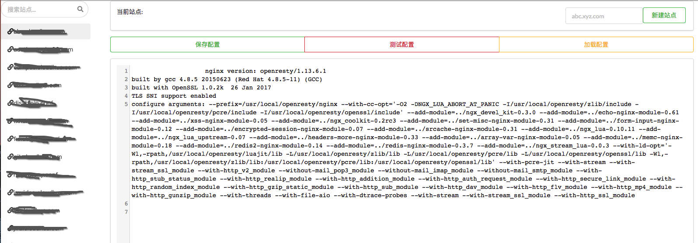

# ngxMan 

> vue + iview 版本，当前版本主要是为了学习vue + iview 的开发

> 当前开发状态: 未完成

nginx 管理服务，提供简单的web 管理功能


# 编译
```
go build -o ngxMan .
```

# 配置

按实际环境配置 `cfg.json`

- `httpaddr` 配置web 服务监听地址
- `logpath` 配置日志路径
- `auth` 配置登录用户，使用basic auth
- `ngxbin` 指定nginx 二进制执行路径，当前示例使用`openresty`
- `ngxMainConfig` 指定nginx 主配置文件路径
- `ngxAllowedPorts` 指定需要使用的端口白名单
- `ngxSiteConfigDir` 指定nginx 站点配置目录路径
- `ngxBackupDir` 指定配置备份目录路径，需要提前创建，每次保存会做一次配置备份


示例
```
{
    "httpaddr": "0.0.0.0:10000",
    "logpath": "ngxman.log",
    "auth": {"name": "admin", "password": "123456"},
    "ngxbin": "openresty",
    "ngxMainConfig": "/usr/local/openresty/nginx/conf/nginx.conf",
    "ngxAllowedPorts": ["80", "443"],
    "ngxSiteConfigDir": "/usr/local/openresty/nginx/conf/conf.d",
    "ngxBackupDir": "/path/to/backup"
}
```


# 部署
1. 创建服务安装目录，`mkdir -p /opt/ngxMan`
2. 将上一步编译后的`ngxMan` 以及 配置好的 `cfg.json` 和 `views` 目录拷贝到 `/opt/ngxMan` 下
3. ./ngxMan 启动服务


# 使用帮助
1. 搜索栏可以快速查找站点
2. 点击新建站点创建站点，命名规则必须配置子域名，如 `abc.xyz.com` 
3. 新建站点会使用`views/newsite.html` 模板生成预设配置，可以按需修改
4. 单击左侧站点名可以浏览站点配置内容 
5. 双击左侧站点名可以重命名站点
6. 保存配置会将配置上传到`ngxSiteConfigDir`，并备份原有配置到`ngxBackupDir`
7. 测试配置会使用`ngxbin -t` 进行测试
8. 加载配置会使用`ngxbin -s reload` 进行加载

# 预览

